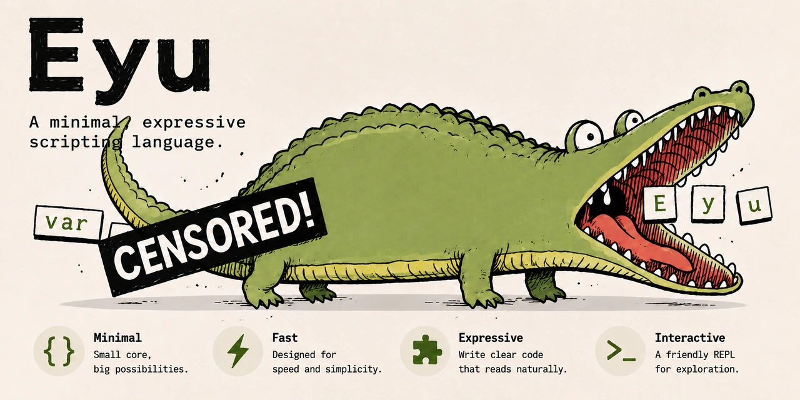

<div align="center">

<p align="center">
  
</p>

# 🐊 Eyu — 用 C++20 从零实现一门脚本语言

<p align="center">
  <a href="https://github.com/michaelchern/Eyu/stargazers">
    
  </a>
  <a href="https://github.com/michaelchern/Eyu/network/members">
    
  </a>
  <a href="https://github.com/michaelchern/Eyu/issues">
    
  </a>
  <a href="https://en.cppreference.com/w/cpp/20">
    
  </a>
  <a href="LICENSE">
    
  </a>
</p>

<p align="center">
  <strong>Minimal · Fast · Expressive · Interactive</strong>
</p>

</div>

---

Eyu 是一个使用 **C++20** 实现的轻量级脚本语言项目，目标是构建从源代码解析、字节码生成到虚拟机执行的完整工具链。

项目重点关注编译器前端、运行时系统、内存管理与工程化架构，并将逐步实现函数、闭包、对象模型、垃圾回收、错误诊断和字节码优化等核心能力。

> [!NOTE]
> Eyu 仍处于早期开发阶段，语法和实现方案都可能随着开发进度调整。当前已完成 C++20 基础工程搭建。

- [🎯 项目目标](#项目目标)
- [🧠 实现路线](#实现路线)
- [🗂️ 仓库结构](#仓库结构)
- [💻 开发环境与构建](#开发环境与构建)
- [📋 开发进度](#开发进度)
- [🧭 设计原则](#设计原则)
- [📄 许可与声明](#许可与声明)

## 项目目标

Eyu 的核心目标是构建一套结构清晰、可测试、可扩展的语言实现，覆盖源代码从文本到可执行行为的完整过程：

- **语言前端**：实现词法分析、语法分析、AST 构建与错误恢复
- **语义分析**：实现作用域、变量解析、闭包、函数与对象模型
- **字节码编译**：将源代码编译为紧凑的字节码指令与常量表
- **虚拟机**：构建基于栈的 VM，实现指令派发、调用栈和运行时对象
- **内存管理**：管理对象生命周期、字符串驻留与垃圾回收
- **现代 C++ 工程化**：使用 C++20、CMake、单元测试和持续集成组织可维护的代码
- **设计文档**：记录语法定义、架构决策、调试过程与实现取舍

在完成核心语言功能后，项目会再逐步探索模块系统、静态类型、字节码优化、调试工具等延伸方向。

## 实现路线

Eyu 计划分为四个彼此衔接的开发阶段：

1. **扫描与解析**：将源代码转换为 Token，并通过递归下降与 Pratt Parser 生成语法结构。
2. **树遍历执行**：先以 AST 解释器验证语法和语义设计，建立作用域、函数、闭包与类。
3. **字节码编译**：将语法结构编译为 Eyu 字节码，并提供反汇编工具辅助调试。
4. **虚拟机与运行时**：执行字节码，逐步完善对象表示、函数调用、闭包和垃圾回收。

```text
Source Code
    │
    ▼
Scanner ──► Tokens ──► Parser / Compiler ──► Bytecode
                                                     │
                                                     ▼
                                              Virtual Machine
                                                     │
                                                     ▼
                                                   Result
```

## 仓库结构

> [!NOTE]
> 当前先落地最小可构建骨架，各模块会随着开发进度逐步增加具体实现。

```text
Eyu/
├── app/                      # CLI 与 REPL 入口
├── cmake/                    # CMake 辅助模块
├── docs/                     # 语言规范、设计文档与图片
├── src/
│   ├── frontend/             # Token、扫描器、解析器与语义分析
│   ├── bytecode/             # Opcode、指令块、常量表与反汇编
│   ├── compiler/             # 字节码编译器
│   ├── runtime/              # 值、对象、原生函数与内存管理
│   └── vm/                   # 指令循环、操作数栈与调用帧
├── tests/                    # 单元测试、集成测试与语言行为测试
├── CMakeLists.txt
├── CMakePresets.json
└── README.md
```

## 开发环境与构建

### 计划支持的开发环境

| 项目 | 环境 |
| --- | --- |
| 语言标准 | C++20 |
| 构建工具 | CMake 3.28+、Ninja |
| 编译器 | MSVC、LLVM Clang、Apple Clang |
| 操作系统 | Windows 11 / macOS / Linux |
| 开发工具 | Visual Studio 2022 / Visual Studio Code / CLion |

### 获取源码

```bash
git clone https://github.com/michaelchern/Eyu.git
cd Eyu
```

### 配置、构建与测试

```bash
cmake --preset debug
cmake --build --preset debug
ctest --preset debug
```

构建后可以运行当前的 CLI 骨架：

```bash
./out/build/debug/bin/eyu --help
./out/build/debug/bin/eyu --version
```

Release 构建可将上述 `debug` 替换为 `release`。Windows 上的可执行文件名为 `eyu.exe`。

> [!IMPORTANT]
> 当前可执行程序只提供基础的帮助和版本信息，语言解析、REPL 与脚本执行尚未实现。

## 开发进度

下表记录 Eyu 的功能规划与实现状态，会随开发进度持续更新。

| 阶段 | 内容 | 状态 | 测试 | 笔记 |
| :---: | --- | :---: | :---: | :---: |
| 00 | 项目规划与基础工程 | ✅ | ✅ | 🚧 |
| 01 | 词法分析与 Token | ⬜ | ⬜ | ⬜ |
| 02 | 表达式与语法分析 | ⬜ | ⬜ | ⬜ |
| 03 | AST 与树遍历解释器 | ⬜ | ⬜ | ⬜ |
| 04 | 作用域、函数与闭包 | ⬜ | ⬜ | ⬜ |
| 05 | 字节码格式与编译器 | ⬜ | ⬜ | ⬜ |
| 06 | 栈式虚拟机 | ⬜ | ⬜ | ⬜ |
| 07 | 类、方法与对象模型 | ⬜ | ⬜ | ⬜ |
| 08 | 垃圾回收与运行时优化 | ⬜ | ⬜ | ⬜ |
| 09 | CLI、REPL、调试与工程化 | ⬜ | ⬜ | ⬜ |

> **图例**：✅ 已完成　|　🚧 进行中　|　⬜ 计划中

## 设计原则

- **保持简洁**：优先实现小而一致的语言核心，避免过早引入复杂特性
- **边界清晰**：让扫描器、解析器、编译器、虚拟机与运行时保持明确职责
- **错误友好**：尽可能提供包含位置、上下文和修复线索的诊断信息
- **可观测**：为 Token、AST、字节码和 VM 执行过程提供可选的调试输出
- **可验证**：通过单元测试、语言行为测试和回归测试保证实现稳定
- **渐进优化**：先保证语义正确和实现清晰，再根据可量化结果优化性能

## 许可与声明

Eyu 是一个正在开发中的个人语言实现项目，不建议在未经充分测试的情况下用于生产环境。

项目自有代码采用 [MIT License](LICENSE) 授权。项目中引入的第三方代码、工具与资源分别遵循其原始许可条款，相关版权归各自权利人所有。

欢迎一起探索语言是如何被设计、编译与执行的。
